# Resultados del Análisis de Datos

## Introducción
Este apartado presenta los resultados obtenidos tras aplicar las técnicas de minería de datos desarrolladas. Se incluyen visualizaciones y análisis descriptivos que facilitan la interpretación de los resultados.

Para mostrar los resultados de manera efectiva, se presentarán solo los resultados de aplicar las técnicas a un jugador específico. Sin embargo, estos mismos análisis se han realizado para todos los jugadores que hemos recopilado. En este caso el jugador seleccionado es **Ferran**.

Además, vamos a mostrar todas las diferentes formas que hemos usado para calcular el error de las predicciones.

---

## 1. Análisis de Tópicos con LdaSeqModel

### 1.1 Evolución de los Tópicos a lo Largo del Tiempo
Se presentan los resultados del análisis de tópicos dinámicos, mostrando cómo los temas relacionados con los jugadores evolucionan a lo largo de la temporada:

- **Visualización de Tópicos por Período**  
Este es un ejemplo pequeño de algunos topicos identificados en los primeros meses de la temporada
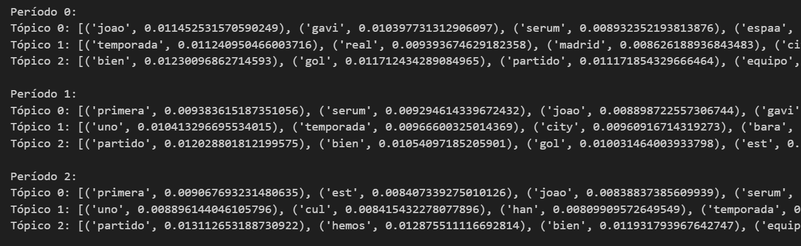

## 2. Predicción de Rendimiento con SARIMAX
Si bien tenemos muchas (sí muchas) combinaciones de distintas series exógenas para predecir el rendimiento de los jugadores, y además, distintos intervalos de predicción, vamos a coger una muestra representativa de los resultados obtenidos.

### 2.1 Modelo SARIMAX con Variables Exógenas
Primero vamos a ver ejemplos con series en las que hemos incluido variables exógenas.

- **Predicción unicamente del rendimiento el día del partido**  
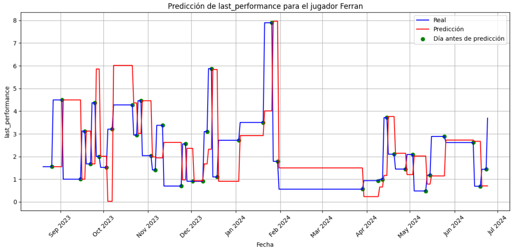  
*(Figura 1: Predicción del rendimiento del jugador ferran a partir del dia anterior unicamente el dia del partido)*
 
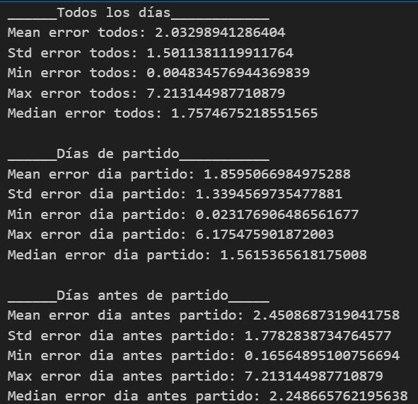  
*(Figura 2: Errores del modelo)*

- **Predicción del rendimiento desde el dia del partido hasta el dia anterior al proximo partido**  
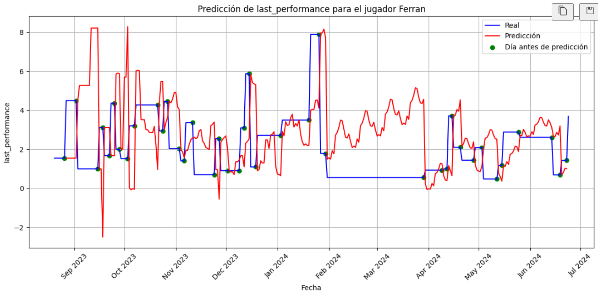  
*(Figura 3: Predicción del rendimiento del jugador ferran a partir del dia anterior del partido de los dias desde el partido hasta el dia anterior al siguiente partido)*
 
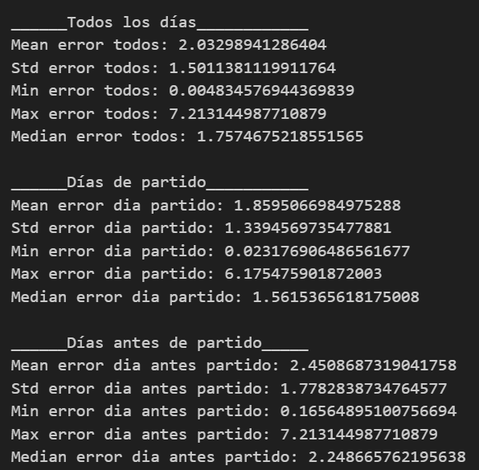  
*(Figura 4: Errores del modelo)*

- **Predicción del rendimiento dia a dia**  
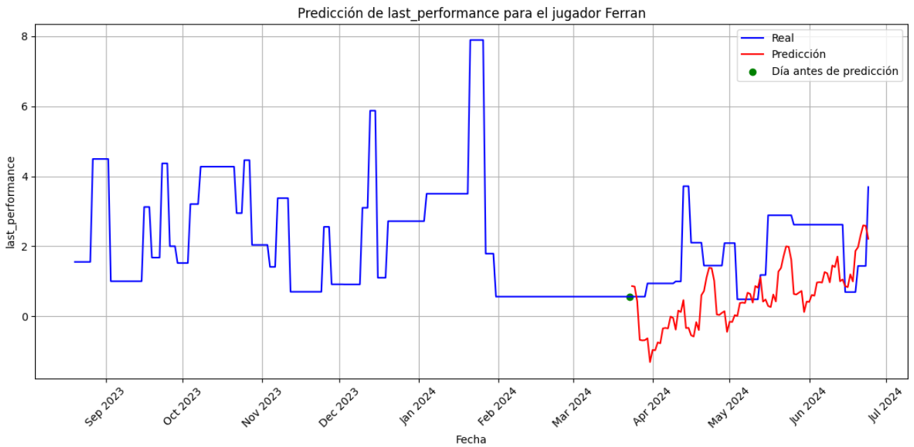  
*(Figura 5: Predicción del rendimiento del jugador ferran a partir de un punto, dia a dia hasta el final de temporada)*
 
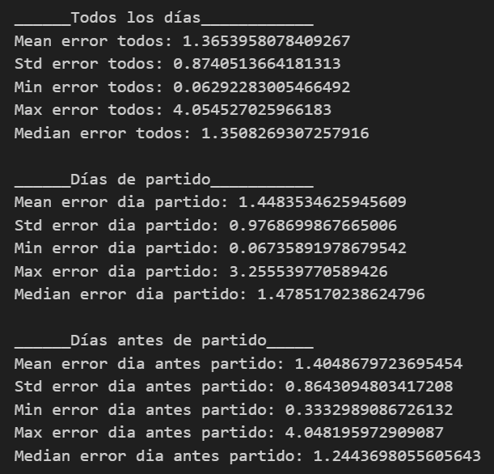  
*(Figura 6: Errores del modelo)*

### 2.2 Modelo SARIMAX sin Variables Exógenas
Vamos a mostrar unicamente, para no alargar demasiado el informe, un ejemplo de predicciones sin variables exógenas que corresponderá al metodo de predicción de predecir el periodo entre el partido anterior y el siguiente partido.

- **Gráfico de Predicciones sin Variables Exógenas**  
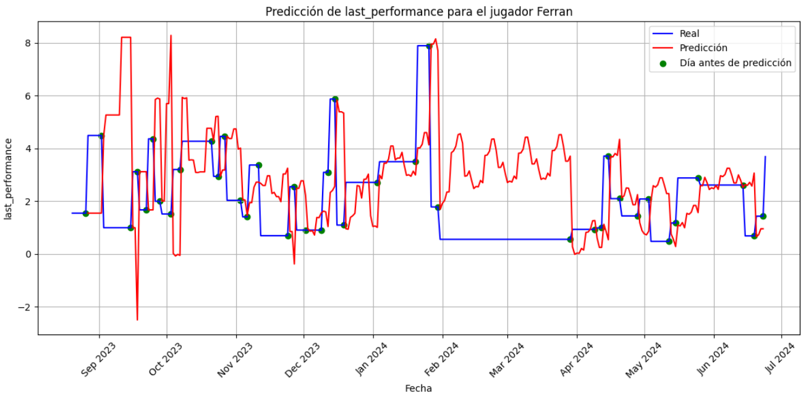  
*(Figura 7: Predicciones realizadas sin considerar variables exógenas.)*

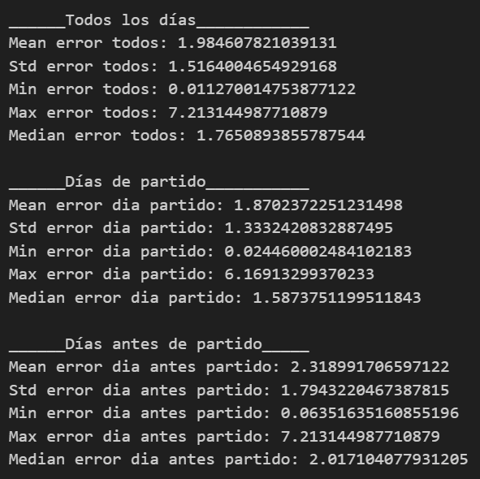
*(Figura 8: Errores del modelo)*

### 2.3 Modelo SARIMAX predicción inversa
Tambien hemos hecho las mismas pruebas con cada jugador pero "a la inversa", es decir, en vez de predecir el rendimiento de un jugador a partir de la opinión pública, hemos intentado predecir la opinión pública a partir del rendimiento del jugador. Se va a mostrar solo un ejemplo de esto.

- **Gráfico de Predicciones con Variables Exógenas**  
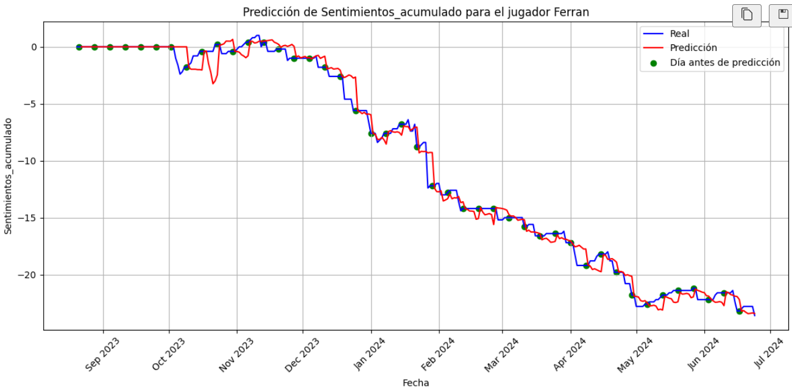  
*(Figura 9: Predicciones realizadas considerando variables exogenas.)*

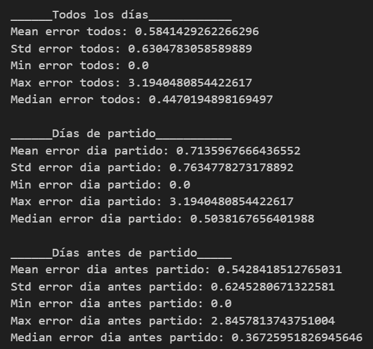
*(Figura 10: Errores del modelo)*

- **Gráfico de Predicciones sin Variables Exógenas**  
  
*(Figura 9: Predicciones realizadas sin variables exogenas.)*

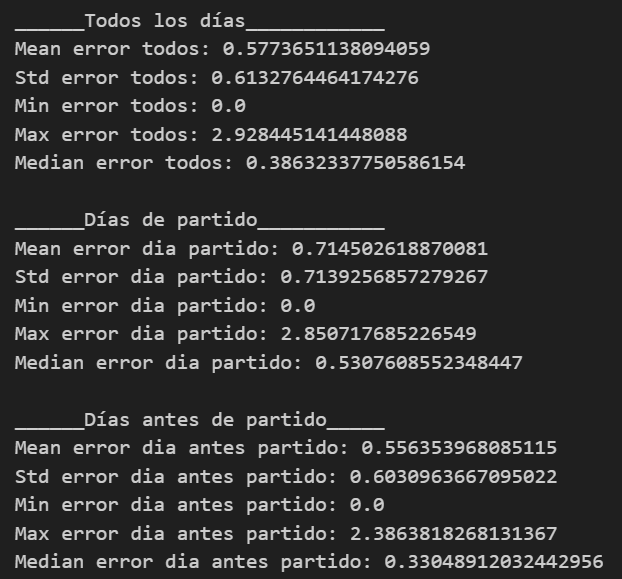
*(Figura 10: Errores del modelo)*

